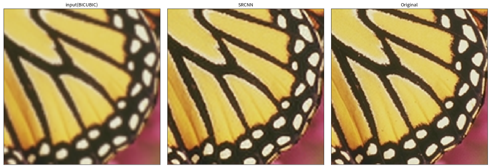
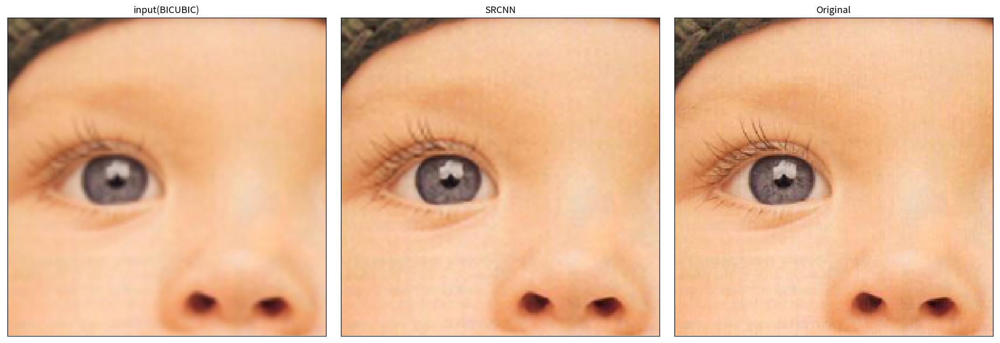

# SRCNN Pytorch

SRCNN Implementation using pytorch 🎉

## Result

train on 91 images and validate on `SET5` image. `BICUBIC` > `SRCNN output` > `Original Image`

> Butterfly



> baby



## Requierments

* docker
* docker-compose

## SetUp

```bash
# 環境変数のコピー. 自分でいい感じにデータセットへのパスを書き換えてください
cp project.env .env

# image の build
docker-compose build

# jupyter server の container が起動
docker-compose up -d

# コードの実行は container 内部でね
docker exec -it srcnn-pytorch bash
# or docker exec -it srcnn-pytorch zsh
```

## `.env` Setting

* `DATASET_DIR`: Path to Dataset directory on your local PC
* `SLACK_INCOMING_URL`: slack incoming url. If Set, post learning log to your slack channel.

## データセットの準備

> TODO

## Train

```bash
python train.py -h

usage: train.py [-h] [--debug] [--dataset DATASET] [--valid VALID]
                [--optimizer OPTIMIZER] [--lr LR] [--decay DECAY]
                [--final_lr FINAL_LR] [--batch BATCH]

optional arguments:
  -h, --help            show this help message and exit
  --debug               If add it, run with debugging mode (not record and
                        stop one batch per epoch (default: False)
  --dataset DATASET     dataset name (default: 91)
  --valid VALID         validation dataset name (default: Set5)
  --optimizer OPTIMIZER
                        Optimizer Name (default: sgd)
  --lr LR               learning rate (default: 0.1)
  --decay DECAY         weight decay (default: 1e-08)
  --final_lr FINAL_LR   final learning rate (only activa on
                        `optimizer="adabound"` (default: 0.1)
  --batch BATCH         training batch size (default: 128)
```

## Watch Learning Log

`./run_tensorboard.sh` start tensorboard on localhost:5001
